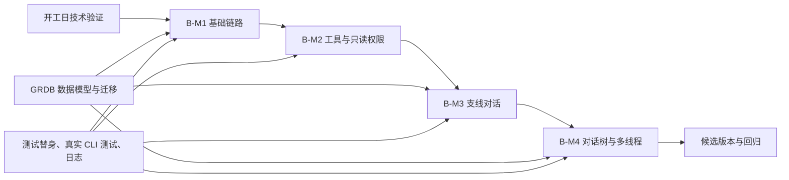

# 分支对话面板 · 开发流程（执行版）

> 基于：《分支对话面板 · 开发文档（macOS 原生）》v1.0（2026-07-25）
> 目标版本：第一阶段可日常自用版
> 技术路线：ACP 客户端 × macOS 原生应用（Swift + SwiftUI）
> 最低系统：macOS 14+
> 执行基线：单人 11～12 个工作日；若 Swift SDK 不可用，Rust FFI 方案另增加 1～2 个工作日

> **v1.1 精简说明（2026-07-31）**：本文档定位调整为**设计规格参考**，不再作为流程执行要求。具体地：
> - §2.2/2.3/2.4（状态流转/DoR/DoD）、§4（排期）、§10.5（每阶段回归原则）、§12（任务拆解清单）降为参考，不再执行——单人开发实测这些仪式只剩打勾成本（11 个任务一天完成，12 天基线证伪）；
> - §5～§8 的技术设计（状态机、数据模型、锚点、上下文组装等）与 §6.4/§7.9/§8.6 测试矩阵**继续有效**，是实现与验收依据；
> - 唯一执行面 = `TODO.md`（工作约定见其文首）；排坑知识记 `doc/工程笔记.md`；硬决策才写 ADR。

---

## 0. 文档使用说明

本文把原开发文档中的产品需求、技术架构和 B-M1～B-M4 里程碑拆解为可执行任务，并为每个阶段定义：

1. 输入与前置条件；
2. 实现顺序；
3. 交付物；
4. 验收门槛；
5. 测试范围；
6. 失败回退方案。

标记约定：

- **已确认**：直接来自原开发文档，执行时不得自行改变。
- **流程补充**：为了让项目可以落地而补充的工程流程、状态或文档要求。
- **待验证**：依赖 ACP、Kimi Code CLI 或 SDK 实际能力，必须通过技术验证后才能定案。
- **待决策**：原文没有给出明确答案，需要在对应阶段形成 ADR（架构决策记录）。

---

## 1. 第一阶段范围与完成标准

### 1.1 必须交付

第一阶段完成后，应用至少具备以下能力：

- 启动时检测 Kimi Code CLI 是否存在、是否支持 `acp` 子命令、登录态是否有效；
- 启动和监控 `kimi acp` 子进程；
- 建立 ACP session，完成主对话多轮交流和流式渲染；
- 渲染 Markdown 与代码高亮；
- 内联显示工具调用、参数摘要、执行状态和结果摘要；
- 严格执行只读权限：读文件、列目录、搜索自动批准；写文件、编辑文件、终端命令自动拒绝；未知操作默认拒绝；
- 从 AI 回答或工具调用结果中选中文字并创建支线；
- 支线使用独立 ACP session，可继续多轮追问；
- 支持支线嵌套，并自动携带祖先链上下文；
- 支持将支线结论压缩后回流主线；
- 右侧支线栏以标签页管理支线，并显示锚点引文；
- 左侧以缩进树展示主线程与支线关系；
- 从树节点或锚点引文回跳原文并高亮；
- 支持至少“创建、列表、切换”三项主线程管理能力；
- 使用 SQLite/GRDB 持久化线程、消息、支线关系和回流笔记；
- 应用重启后能够恢复本地对话树；ACP session 的续接能力以协议实测结果为准。

### 1.2 明确不做

第一阶段不得把以下内容混入开发范围：

- 修改文件、写文件或执行终端命令；
- 多人协作、账号体系、云同步；
- Windows 或 Linux 版本；
- 画布式节点图；
- 历史导入、Prompt 预设；
- Apple 签名、公证和正式分发；
- 可配置写权限、终端白名单或逐次询问策略。

### 1.3 MVP 完成判定

只有同时满足以下条件，版本才可标记为第一阶段完成：

- B-M1、B-M2、B-M3、B-M4 的退出门槛全部通过；
- 只读安全测试矩阵全部通过，不允许存在“未知权限类型被放行”的情况；
- 主对话、支线、嵌套支线、回流和树回跳形成一条完整可重复演示的用户路径；
- 子进程异常退出、应用重启和 ACP 消息异常至少具有明确错误状态与恢复入口；
- 数据库迁移可在空库与已有测试库上执行；
- 已锁定并记录一组通过验证的 Kimi Code CLI 版本和 ACP 协议/SDK 版本。

---

## 2. 工作项与流转规则

### 2.1 工作项层级

采用以下层级拆解工作：

- **Milestone**：B-M1～B-M4；
- **Story**：用户可观察到的一项完整能力；
- **Task**：可在半天到一天内完成的工程任务；
- **Test Case**：可重复执行并产生通过/失败结果的验证项；
- **ADR**：影响架构、协议、数据模型或兼容策略的决策记录。

### 2.2 状态流转

```text
Backlog → Ready → In Progress → Review → Verify → Done
                         ↘ Blocked ↗
```

状态定义：

| 状态 | 进入条件 | 退出条件 |
|---|---|---|
| Backlog | 已记录需求，但依赖或验收条件尚不完整 | 补齐前置条件和验收标准 |
| Ready | 输入、依赖、验收条件明确 | 开始编码或验证 |
| In Progress | 已创建开发分支并开始实现 | 提交可审查变更和测试证据 |
| Review | 实现完成，等待代码/设计检查 | 审查问题已解决 |
| Verify | 已合并或形成候选构建 | 自动测试与手工验收通过 |
| Done | 验收门槛通过，文档同步 | 无 |
| Blocked | 受 SDK、协议、CLI 或其他工作项阻塞 | 阻塞原因解除并记录处理结论 |

### 2.3 Definition of Ready

一个任务进入 Ready 前必须具备：

- 明确关联 B-M1～B-M4 中的一个阶段；
- 写明输入、输出和不做事项；
- 列出依赖任务；
- 至少一条可执行验收条件；
- 涉及 ACP 的任务必须说明使用真实 CLI、测试替身或两者都需要；
- 涉及数据模型的任务必须说明迁移影响；
- 涉及权限的任务必须说明默认拒绝行为。

### 2.4 Definition of Done

一个任务只有满足以下条件才能关闭：

- 代码已合并到主开发分支；
- 新增或更新测试已通过；
- 错误状态和空状态已处理；
- 日志不默认记录完整项目文件内容、完整提示词或登录信息；
- 数据结构、协议适配或用户行为变化已同步到文档；
- 验收步骤可由另一人或未来的自己重复执行；
- 没有把 P2 或第一阶段非目标偷偷引入范围。

### 2.5 分支与提交规范（流程补充）

建议采用短分支开发：

```text
spike/acp-swift-sdk
feat/bm1-process-supervisor
feat/bm2-permission-policy
feat/bm3-branch-context
feat/bm4-conversation-tree
fix/stream-reconnect
```

提交信息建议使用：

```text
feat(acp): establish session and stream text deltas
fix(policy): deny unknown permission request types
refactor(branch): isolate context assembly from session creation
test(recovery): cover subprocess crash during streaming
```

每个合并请求只解决一个 Story 或一组强相关 Task，避免同时修改协议层、数据模型和多个 UI 区域。

---

## 3. 总体依赖与阶段门槛



阶段不得只按“代码写完”判断完成，必须通过对应 Gate：

| Gate | 阶段 | 核心问题 |
|---|---|---|
| G0 | 开工日 | Swift SDK/FFI 路径是否可行，ACP 完整链路是否打通 |
| G1 | B-M1 | 主对话能否稳定建立 session、流式输出并处理子进程异常 |
| G2 | B-M2 | 所有非读操作和未知操作是否确定被拒绝且可见 |
| G3 | B-M3 | 任意有效选区能否形成独立、可嵌套、可回流的支线 |
| G4 | B-M4 | 对话树、原文锚点、多线程和本地恢复是否一致 |
| RC | 候选版本 | 核心路径、迁移、异常恢复和安全回归是否全部通过 |

---

## 4. 建议排期

原文各阶段工作量相加为 11～12 个工作日，因此执行时采用 12 日基线。“约 2 周”可作为压缩目标，但不应以跳过权限测试或恢复测试为代价。

| 工作日 | 阶段 | 当日目标 | 当日结束条件 |
|---|---|---|---|
| D1 | B-M1 / G0 | SDK、ACP、permission、长上下文四项验证 | 形成 ADR-001，确定 Swift SDK 或 Rust FFI 路径 |
| D2 | B-M1 | Swift 项目骨架、CLI 启动检查、子进程管理 | 能启动/停止 `kimi acp`，状态可观察 |
| D3 | B-M1 | JSON-RPC/ACP 适配、session 创建、事件归一化 | 能创建 session 并接收文本事件 |
| D4 | B-M1 | 主对话 UI、流式渲染、基础持久化、异常状态 | G1 通过 |
| D5 | B-M2 | 工具调用事件与折叠卡片 | 工具调用生命周期可视化 |
| D6 | B-M2 | 权限策略器与拒绝通知 | 安全矩阵核心用例通过 |
| D7 | B-M2 | Markdown、代码高亮、B-M2 回归 | G2 通过 |
| D8 | B-M3 | 文本选区、锚点、支线创建状态机 | 从主对话可创建一级支线 |
| D9 | B-M3 | 上下文组装、长历史压缩、嵌套支线 | 至少三级支线链可运行 |
| D10 | B-M3 | 回流、右侧标签栏、异常与幂等处理 | G3 通过 |
| D11 | B-M4 | 左侧树、节点卡片、树与原文联动 | 树结构与锚点回跳通过 |
| D12 | B-M4 / RC | 多线程、本地恢复、全量回归、候选构建 | G4 与 RC 通过 |

若 D1 确认必须走 Rust FFI，应立即把额外 1～2 个工作日加入 B-M1，而不是在后续阶段隐性压缩。

---

## 5. B-M1：项目骨架、ACP 基础链路与主对话

### 5.1 阶段目标

完成从 macOS App 到 `kimi acp` 的最小闭环：

```text
应用启动
→ 环境检测
→ 启动子进程
→ ACP 握手
→ 创建 session
→ 发送用户消息
→ 接收流式响应
→ 渲染并持久化
```

### 5.2 G0：开工日技术验证

#### M1-SPIKE-01：验证 Kimi Code CLI 环境

执行内容：

- 定位 CLI 可执行文件；
- 读取 CLI 版本；
- 验证 `acp` 子命令存在；
- 验证登录态可用于 ACP 子进程；
- 记录命令退出码、标准输出、标准错误和用户可理解的失败原因。

交付物：

- `CLIEnvironmentProbe` 原型；
- 一份通过验证的 CLI 版本记录；
- 缺失 CLI、版本不兼容、未登录三种失败截图或日志。

验收：

- 应用能够把三类失败区分开，不统一显示成“启动失败”；
- 检测过程不修改用户环境。

#### M1-SPIKE-02：验证 ACP SDK 路径

按以下顺序验证：

1. 查明是否存在可用且版本匹配的官方 ACP Swift SDK；
2. 用最小程序完成初始化、握手、session 创建和消息接收；
3. 若 Swift SDK 缺失或覆盖不足，验证 Rust ACP SDK 能否通过稳定 FFI 边界暴露所需能力；
4. 记录两种路径在构建、错误处理、异步流和类型映射上的差异。

必须形成 ADR-001：

```text
标题：ACP 客户端实现路径
结论：Swift SDK / Rust SDK + FFI
依据：协议覆盖、版本匹配、构建复杂度、错误可观测性
被否决方案：说明原因
兼容版本：CLI / ACP / SDK
回退触发条件：何时重新评估
```

#### M1-SPIKE-03：验证 ACP 完整链路

必须实测以下事件，而不是只验证“可以连接”：

- 握手成功与失败；
- 创建 session；
- 发送用户消息；
- 接收文本流；
- 工具调用事件；
- permission request 回调；
- 正常完成事件；
- 子进程主动退出或崩溃；
- 应用关闭时的正常终止。

输出一份“原始 ACP 事件样本”，用于后续开发测试替身。样本需要脱敏，不能包含真实项目内容或登录信息。

#### M1-SPIKE-04：验证长背景播种

建立新 session，发送包含“背景上下文 + 选中段落 + 用户追问”的首条消息，确认：

- CLI 是否接受足够长的首条消息；
- 流式返回与普通会话是否一致；
- 是否出现长度限制、截断、超时或异常计费表现；
- session 历史是否只包含播种后的支线历史；
- 使用摘要后是否能稳定保持问题指向。

原文没有规定压缩阈值。此阶段只记录实测数据，并创建 `TBD_CONTEXT_COMPRESSION_THRESHOLD`，不得未经测试直接写死字符数或 token 数。

### 5.3 G0 退出门槛

只有满足以下条件才能进入正式 B-M1 开发：

- 已选择 Swift SDK 或 Rust FFI 路径；
- 握手、session、文本流和 permission request 均有真实样本；
- 已明确 ACP 消息 framing 与关闭方式；
- 已记录 session 是否支持枚举、恢复或续接；
- 已验证新 session 的长背景播种路径；
- 无法确认的协议能力已列入“待验证清单”，并有保守回退方案。

### 5.4 项目结构

建议按职责拆分，而不是按界面文件堆叠：

```text
App/
  BranchConversationApp.swift
  AppEnvironment.swift

Features/
  MainChat/
  BranchPanel/
  ConversationTree/
  Settings/

Core/
  ACP/
    ACPClient.swift
    ACPTransport.swift
    ACPEventAdapter.swift
    ACPSessionStore.swift
  Process/
    CLIEnvironmentProbe.swift
    ACPProcessSupervisor.swift
  Policy/
    PermissionPolicyEngine.swift
  Branching/
    BranchContextAssembler.swift
    BranchMergeService.swift
  Persistence/
    AppDatabase.swift
    Migrations.swift
    Repositories/

Shared/
  Models/
  UIComponents/
  Logging/
  TestSupport/
```

核心约束：

- UI 不直接读写 Pipe；
- ACP SDK 类型不得直接扩散到所有 Feature；
- permission 回调只进入策略器，不由 View 决定；
- 数据库存取通过 Repository 或明确的数据访问层；
- 分支上下文组装独立于 UI 和 ACP session 创建。

### 5.5 子进程管理

`ACPProcessSupervisor` 至少管理以下状态：

```text
notChecked
cliMissing
loginRequired
unsupportedVersion
stopped
starting
ready
restarting
failed(reason)
```

实现顺序：

1. 环境检测；
2. 创建 `Process` 与标准输入、输出、错误 Pipe；
3. 启动后等待 ACP 可用信号或握手结果；
4. 转发输出给 ACP transport；
5. 监听 termination handler；
6. 应用正常退出时关闭 session、Pipe 和子进程；
7. 异常退出时进入 `restarting`，限制自动重启次数，避免无限崩溃循环；
8. 重启后重新探测 session 恢复能力。

流程补充：自动重启建议采用有限次数和退避策略。具体次数不是产品需求，先作为内部配置，并在真实 CLI 测试后调整。

### 5.6 ACP 适配层

ACP 适配层对上层输出统一领域事件。建议事件模型如下：

```swift
enum AgentEvent {
    case textDelta(String)
    case toolCallStarted(ToolCallViewData)
    case toolCallUpdated(ToolCallViewData)
    case toolResult(ToolResultViewData)
    case permissionRequested(PermissionRequestData)
    case notice(String)
    case completed
    case failed(AgentError)
}
```

这些名称属于流程补充，实际字段以 ACP 实测协议为准。适配层负责：

- SDK/JSON-RPC 类型到领域类型的映射；
- 事件顺序和 session 归属校验；
- 未知事件的保留与日志记录；
- 协议错误到用户错误的转换；
- 将 permission request 路由给策略器；
- 不在此层做界面状态判断。

### 5.7 主对话状态机

建议主对话发送流程：

```text
idle
→ sending
→ streaming
→ completed
↘ failed(retryable / nonRetryable)
```

实现要求：

- 用户发送后立即保存 user message；
- 创建一条 `streaming` 状态的 assistant message 占位；
- 文本 delta 按顺序追加到同一消息；
- 完成时原子更新为 `completed`；
- 中断时保留已接收内容，并标记 `interrupted`，不伪装为完整回答；
- 重试需要产生明确的新请求，不得悄悄重复扣取额度；
- 切换线程时，旧线程的流式事件仍必须正确路由到原线程。

### 5.8 数据库首版迁移

原文核心表保持不变：

```text
threads
messages
branches
branch_notes
```

为支持流式、排序和错误恢复，建议在首版迁移中补充以下工程字段；这些字段属于待决策，不改变原有业务含义：

| 表 | 建议字段 | 用途 |
|---|---|---|
| messages | `sequence` | 保证同一会话内稳定排序 |
| messages | `status` | streaming/completed/interrupted/failed |
| messages | `updated_at` | 流式写入和恢复 |
| messages | `metadata_json` | 存储工具调用或协议扩展字段 |
| threads | `updated_at` | 最近活动排序 |
| branches | `updated_at` | 支线状态变化 |
| branches | `merge_note_id` | 防止重复回流 |

迁移要求：

- 每次 schema 变化必须新增 migration，不直接修改已发布 migration；
- 对空库与上一版测试库都运行迁移测试；
- 创建线程、消息和 session 映射时使用事务，避免只写入一半；
- 不把完整 ACP SDK 对象直接序列化进数据库。

### 5.9 B-M1 交付物

- 可构建运行的 Swift/SwiftUI 工程；
- CLI 环境检测界面；
- `kimi acp` 子进程管理器；
- ACP 适配层与 session 管理；
- 主对话输入区和流式文本渲染；
- 基础 SQLite/GRDB 迁移；
- 脱敏协议样本与测试替身；
- ADR-001 和兼容版本记录；
- B-M1 测试报告。

### 5.10 G1 验收场景

必须逐条执行：

1. CLI 已安装且已登录：应用进入可对话状态；
2. CLI 缺失：显示安装引导，不崩溃；
3. CLI 不支持 `acp`：显示版本不兼容；
4. 登录失效：显示登录引导；
5. 创建主线程并发送消息：收到连续流式文本；
6. 流式中切换线程再切回：内容仍写入正确线程；
7. 流式中杀死子进程：消息标记为中断，应用进入可恢复状态；
8. 重新启动子进程：可继续新 session；是否续接旧 session 按实测能力处理；
9. 退出并重开应用：本地线程和消息仍存在；
10. 协议收到未知事件：应用不崩溃，事件被保守记录。

---

## 6. B-M2：工具调用、权限策略与富文本渲染

### 6.1 阶段目标

把 ACP 的工具行为转成用户可理解、可审计的对话内容，并确保第一阶段绝对只读。

### 6.2 工具调用展示流程

工具调用在 UI 中按以下生命周期呈现：

```text
requested → running → succeeded / failed / denied
```

卡片最少显示：

- 工具名；
- 参数摘要；
- 当前状态；
- 结果摘要；
- 展开/折叠入口；
- 若被拒绝，显示“已按只读策略拦截”；
- 所属消息与时间。

实现要求：

- 参数摘要不得因超长 JSON 卡住主线程；
- 默认折叠大结果；
- 工具调用与工具结果必须通过稳定 call id 或协议等价标识关联；
- 结果到达前保留 running 状态；
- 工具失败和权限拒绝是两种不同状态；
- 工具卡片内容需要持久化，重启后仍可回看；
- 工具结果中的文字可被选中并用于创建支线。

### 6.3 权限策略器

权限决策必须集中在 `PermissionPolicyEngine`，不得散落在 View、按钮回调或工具卡片中。

策略表：

| 操作分类 | 决策 | 用户展示 |
|---|---|---|
| 读文件 | allow | 正常展示调用状态 |
| 列目录 | allow | 正常展示调用状态 |
| 搜索 | allow | 正常展示调用状态 |
| 写文件 | deny | “已按只读策略拦截” |
| 编辑文件 | deny | “已按只读策略拦截” |
| 终端命令 | deny | “已按只读策略拦截” |
| 未知/新增类型 | deny | “未知操作已按保守策略拦截” |
| 无法解析的请求 | deny | “权限请求无法识别，已拒绝” |

实现顺序：

1. 根据真实 ACP 样本建立“协议工具/权限类型 → 内部操作分类”映射；
2. 明确 allowlist 仅包含读文件、列目录、搜索；
3. 所有未命中 allowlist 的请求统一拒绝；
4. 返回符合 ACP 要求的批准/拒绝响应；
5. 在对话流保存一条 `notice`；
6. 记录决策类型和工具名，但默认不记录完整文件内容；
7. 设置页只展示策略，不提供修改入口。

### 6.4 权限安全测试矩阵

| 编号 | 场景 | 预期 |
|---|---|---|
| SEC-01 | 读取普通文件 | 自动批准 |
| SEC-02 | 列目录 | 自动批准 |
| SEC-03 | 文本/代码搜索 | 自动批准 |
| SEC-04 | 新建文件 | 自动拒绝 |
| SEC-05 | 覆盖或追加文件 | 自动拒绝 |
| SEC-06 | 编辑已有文件 | 自动拒绝 |
| SEC-07 | 删除、移动、重命名文件 | 若协议出现，默认拒绝 |
| SEC-08 | 执行任意终端命令 | 自动拒绝 |
| SEC-09 | 未知工具类型 | 自动拒绝 |
| SEC-10 | 权限请求缺少分类字段 | 自动拒绝 |
| SEC-11 | 多个并发权限请求 | 每个请求独立、正确响应 |
| SEC-12 | 拒绝后模型继续回答 | 对话不中断，拒绝标记可见 |
| SEC-13 | 拒绝后应用重启 | 拒绝记录仍可回看 |
| SEC-14 | CLI 升级出现新操作类型 | 不得因未识别而默认批准 |

G2 不允许任何 SEC 用例处于“暂时跳过”。

### 6.5 Markdown 与代码高亮

实现流程：

1. 流式阶段先保证文本持续可见；
2. 对完整或稳定片段做 Markdown 解析；
3. 代码块使用 Splash、Highlightr 或最终选定库；
4. 代码块、引用、列表和普通段落都必须保留可选中文本能力；
5. AppKit 选区层与 Markdown 渲染层不得互相覆盖；
6. 超长代码块默认不一次性做昂贵高亮；
7. 解析失败时回退到纯文本，而不是丢失内容。

待决策：选择 Splash 或 Highlightr。决策依据至少包括 SwiftUI 集成、增量渲染性能、语言覆盖、维护状态和许可证。

### 6.6 B-M2 交付物

- 工具调用折叠卡片；
- 工具事件与结果关联逻辑；
- 权限映射表与只读策略器；
- 设置页只读策略说明；
- Markdown 与代码高亮渲染；
- SEC-01～SEC-14 测试证据；
- ADR-002：Markdown/高亮方案；
- ACP 工具类型兼容记录。

### 6.7 G2 退出门槛

- 所有明确写操作、终端操作和未知操作均被拒绝；
- 拒绝动作不会导致应用死锁或 session 永久挂起；
- 对话流中可见拒绝原因；
- 工具卡片在实时和重启后显示一致；
- Markdown、代码块和工具结果均可选择文字；
- 新增未知 ACP 事件不会绕过策略器。

---

## 7. B-M3：支线创建、嵌套、回流与右侧面板

### 7.1 阶段目标

完成产品核心体验：

```text
选中原文
→ 点击“追问”
→ 输入问题
→ 组装背景
→ 创建独立 ACP session
→ 支线流式对话
→ 可继续嵌套
→ 可把结论回流主线
```

### 7.2 文本选区与锚点

实现顺序：

1. 在主对话的 AI 文本和工具结果上监听有效选区；
2. 忽略空选区、纯空白选区和跨越不支持区域的选区；
3. 显示“追问”浮动入口；
4. 点击后立即冻结一份 selection snapshot，避免用户继续选择导致锚点改变；
5. 保存 `anchor_message_id` 与 `anchor_quote`；
6. 打开右侧支线创建界面；
7. 支线创建成功后使锚点可被树和引文回跳。

原数据模型只包含 `anchor_message_id + anchor_quote`。为解决同一消息内重复引文、Markdown 渲染后偏移和原文变化等问题，建议在 B-M3 前决定是否增加：

```text
anchor_start
anchor_length
anchor_context_hash
```

这是数据模型补充建议，需要 ADR-003 确认。若不增加，必须至少定义“同一句引文多次出现时如何选中正确位置”的回跳规则。

### 7.3 支线创建状态机

```text
idle
→ composingQuestion
→ preparingContext
→ compressingContext（可选）
→ creatingSession
→ sendingSeed
→ streaming
→ ready

任一步骤 → failed(retryable / nonRetryable)
```

状态要求：

- 创建 session 前不得把支线标记为可用；
- session 已创建但播种失败时，保留失败记录用于重试或清理；
- 同一点击操作不得重复创建两个 ACP session；
- 用户取消时，不发送消息，不消耗一次无意义请求；
- 支线创建期间关闭面板，后台任务仍需被明确取消或继续，不能处于无主状态。

### 7.4 背景上下文组装

`BranchContextAssembler` 接收：

```text
thread_id
parent_branch_id（一级支线为空）
anchor_message_id
anchor_quote
user_question
```

建议流程：

1. 读取锚点所在消息；
2. 收集该锚点相关的主线程问答原文；
3. 若来自支线，收集祖先链的锚点、关键问答或摘要；
4. 去除与当前问题明显重复的系统包装文本；
5. 估算上下文长度；
6. 若超过实测阈值，调用 CLI 生成背景摘要；
7. 保存最终 `seed_context`；
8. 创建新的 ACP session；
9. 将“背景上下文 + 选中段落 + 用户追问”作为首条 user message 发送。

建议播种模板：

```text
[背景上下文]
{主线程相关问答，或压缩后的摘要}

[祖先支线]
{存在嵌套时，按根到当前父支线顺序提供锚点与结论}

[当前选中段落]
{anchor_quote}

[用户追问]
{user_question}

[来源说明]
这是从主线程或父支线派生的独立支线。请围绕当前选中段落回答。
```

模板属于流程补充，可根据真实模型表现调整，但必须保持三个核心组成部分可识别：背景、选中段落、用户追问。

### 7.5 上下文压缩流程

原文确认“历史过长时先摘要”，但未规定阈值、摘要 session 或摘要格式。建议采用以下保守流程：

1. 先通过 D1 长上下文验证确定警戒阈值；
2. 只压缩背景历史，不改写 `anchor_quote` 和当前问题；
3. 摘要必须保留事实、约束、未决问题和关键术语；
4. 摘要结果与原始上下文范围一并记录，便于调试；
5. 推荐使用临时独立 session 生成摘要，避免污染主线或支线历史；该做法需实测 ACP 成本与可行性后确认；
6. 摘要失败时，提示用户缩小选区或减少背景，不悄悄截断；
7. 不在第一阶段展示复杂 token 预算 UI。

### 7.6 支线嵌套

嵌套支线的父子关系使用 `parent_branch_id`。

创建嵌套支线时：

- 锚点来自父支线回答或工具结果；
- 新支线必须拥有新的 ACP session；
- 上下文至少包含主线程背景、祖先支线链和当前锚点；
- 祖先链按根到叶排序，避免语义顺序颠倒；
- 关闭父支线不能破坏子支线数据；
- 父支线已合并后仍可保留其子支线，但 UI 必须显示父节点状态；
- 祖先链过长时优先使用祖先摘要，避免每层重复注入全部历史。

最低验收深度建议为三级支线链，用于暴露递归查询和上下文重复问题；这属于工程验收基线，不代表产品限制为三级。

### 7.7 右侧支线栏

右侧固定栏应包含：

- 当前打开支线的标签页；
- 标签标题或问题摘要；
- 锚点引文；
- 锚点点击回跳；
- 支线消息流；
- 输入框；
- “合并回主线”操作；
- open/merged/closed 状态；
- 超过默认 10 轮后的合并并关闭提示。

交互约束：

- 新建支线后自动切换到该标签；
- 标签切换不得改变左侧树结构；
- 锚点回跳只改变主对话滚动与高亮，不替换当前支线；
- 支线正在流式响应时关闭标签，不得删除支线；
- “关闭”是状态变化，不等于物理删除数据；
- 多条支线同时有流式事件时，事件必须按 branch/session 正确路由。

### 7.8 结论回流

回流流程：

1. 用户点击“合并回主线”；
2. 收集该支线需要回流的对话范围；
3. 通过 CLI 压缩为补充笔记；
4. 生成 `branch_notes` 记录；
5. 在主线程追加一条明确标注来源支线的客户端注入消息；
6. 将 `branches.status` 更新为 `merged`；
7. 更新左侧树节点“已回流”标记；
8. 保留原支线历史，不删除；
9. 重复点击时不得生成重复笔记。

建议回流消息格式：

```text
[支线回流笔记]
来源支线：{branch_id 或可读标题}
锚点：{anchor_quote}
结论：{summary}
```

事务要求：`branch_notes` 写入、主线消息追加和 branch 状态更新应在同一数据库事务内完成。若向 ACP 主线程注入上下文失败，需要显示“本地已保存但未注入 session”的可恢复状态，不能直接标记全部成功。

### 7.9 B-M3 测试矩阵

| 编号 | 场景 | 预期 |
|---|---|---|
| BR-01 | 选中 AI 普通文本 | 显示追问入口 |
| BR-02 | 选中工具结果文本 | 显示追问入口 |
| BR-03 | 选择纯空白 | 不显示入口 |
| BR-04 | 取消选区后点击旧入口 | 不使用过期锚点 |
| BR-05 | 创建一级支线 | 新 ACP session、独立历史 |
| BR-06 | 同一锚点连续双击创建 | 不重复创建 |
| BR-07 | 支线创建中 session 失败 | 显示可重试失败状态 |
| BR-08 | 支线内继续追问 | 历史只累积在支线 |
| BR-09 | 创建三级嵌套支线 | 父子关系和祖先上下文正确 |
| BR-10 | 背景超过压缩阈值 | 先摘要再播种，锚点不被改写 |
| BR-11 | 摘要失败 | 不静默截断，用户可恢复 |
| BR-12 | 点击锚点引文 | 主对话滚动并高亮原文 |
| BR-13 | 合并回主线 | 生成一条带来源的补充笔记 |
| BR-14 | 重复点击合并 | 不产生重复笔记 |
| BR-15 | 合并后继续查看支线 | 历史仍存在，状态为 merged |
| BR-16 | 支线超过 10 轮 | 显示“合并回主线并关闭”提示 |
| BR-17 | 多支线同时流式响应 | 各自消息不串线 |
| BR-18 | 应用重启 | 支线树、锚点和回流状态仍在 |

### 7.10 G3 退出门槛

- 主对话与工具结果都可以创建支线；
- 支线使用独立 ACP session；
- 三级嵌套链可稳定运行；
- 长背景压缩路径有明确成功和失败行为；
- 回流操作具备幂等性；
- 支线标签、锚点、状态与数据库一致；
- 任意 session 的流式事件不会写到其他线程或支线；
- BR-01～BR-18 全部通过。

---

## 8. B-M4：左侧对话树、原文回跳、多线程与恢复

### 8.1 阶段目标

将本地线程、支线和锚点组织成可导航的树，并确保应用重启后结构不丢失。

### 8.2 对话树构建

树结构来源：

```text
主线程 = 根节点
parent_branch_id = null 的支线 = 根节点直接子节点
parent_branch_id 指向其他支线 = 嵌套子节点
```

每个节点卡片显示：

- 首条问题摘要；
- 轮数；
- 创建或最近活动时间；
- open/merged/closed 状态；
- “已回流”标记；
- 当前选中状态。

实现要求：

- 树查询不能依赖当前打开的右侧标签；
- 父节点折叠只隐藏子节点，不改变数据；
- 无效 `parent_branch_id` 必须被检测并记录，不能导致无限递归；
- 排序规则需要固定，建议同级按创建时间或最近活动时间；最终规则形成 ADR-004；
- 节点摘要为空时使用锚点引文或稳定占位；
- 大量节点时避免每次流式 delta 都重建整棵树。

### 8.3 树到原文回跳

回跳流程：

1. 用户点击支线节点；
2. 激活或打开对应右侧支线标签；
3. 读取 `anchor_message_id`；
4. 主对话定位到对应消息；
5. 根据锚点范围或引文查找原文位置；
6. 滚动到可见区域；
7. 短暂高亮；
8. 若原文无法精确匹配，至少滚动到所属消息并显示“锚点位置已变化”。

验收重点：

- 树节点点击与锚点引文点击行为一致；
- 同一段落存在重复引文时仍能定位正确位置，或有明确降级规则；
- Markdown 重渲染后锚点仍可定位；
- 长消息滚动精度可接受；
- 高亮结束后不会改写文本选区或意外创建新支线。

### 8.4 多主线程管理

原文只确认“支持多主线程管理”，没有明确完整操作集合。第一阶段最低范围定义为：

- 创建主线程；
- 显示主线程列表；
- 切换主线程；
- 为每个主线程保存独立 `project_root`、ACP session 映射、消息和支线树；
- 最近活动线程排序；
- 应用重启后恢复上次选中线程。

以下操作不自动纳入本阶段，需另行确认：

- 删除线程；
- 归档线程；
- 手动重命名；
- 跨线程移动支线；
- 合并两个主线程。

如果实现删除，必须先定义级联删除、ACP session 清理和不可恢复提示，不得只删除 UI 节点。

### 8.5 应用重启与 session 恢复

恢复流程：

1. 打开数据库并执行 migration；
2. 读取 threads、messages、branches、branch_notes；
3. 还原左树、主对话和右侧支线状态；
4. 执行 CLI 环境检测；
5. 启动 `kimi acp`；
6. 若 ACP 支持 session 枚举/恢复，则按 `acp_session_id` 尝试续接；
7. 若不支持，保留完整本地历史，并把旧 session 标记为不可续接；
8. 用户继续对话时，可创建新 session 并注入必要历史。该回退行为属于流程补充，需在 G0 实测后决定是否启用；
9. 恢复失败不得破坏本地记录。

建议区分：

```text
localHistoryAvailable
sessionResumed
sessionUnavailable
sessionRecreated
```

不要把“本地能看到历史”等同于“CLI session 已成功续接”。

### 8.6 B-M4 测试矩阵

| 编号 | 场景 | 预期 |
|---|---|---|
| TREE-01 | 一级支线 | 显示为根节点子卡片 |
| TREE-02 | 多级支线 | 缩进层级正确 |
| TREE-03 | 点击节点 | 激活支线并回跳锚点 |
| TREE-04 | 点击已回流节点 | 显示 merged 标记，仍可查看 |
| TREE-05 | 父节点折叠/展开 | 数据不变，子节点显示正确 |
| TREE-06 | 异常父 id | 不崩溃，不无限递归 |
| TREE-07 | 重复锚点文本 | 精确定位或按降级规则定位 |
| TREE-08 | Markdown 重新渲染 | 回跳仍有效 |
| THREAD-01 | 创建两个主线程 | 数据与 session 独立 |
| THREAD-02 | 快速切换线程 | 流式事件不串线 |
| THREAD-03 | 不同项目根目录 | 每个线程保持自己的 root |
| THREAD-04 | 重启应用 | 恢复线程、支线和选中状态 |
| REC-01 | ACP 支持恢复 | 旧 session 续接成功 |
| REC-02 | ACP 不支持恢复 | 本地历史可见，继续路径明确 |
| REC-03 | 数据库迁移失败 | 阻止继续写入并提示恢复，不损坏原库 |
| REC-04 | 子进程重启后 session 丢失 | UI 状态与实际能力一致 |

### 8.7 G4 退出门槛

- 树结构与 `parent_branch_id` 完全一致；
- 节点卡片信息、回流标记和状态正确；
- 树 → 原文回跳成为稳定可重复操作；
- 至少两个主线程可独立运行和切换；
- 应用重启后本地数据完整；
- session 恢复能力与 UI 表述一致，不制造“已续接”的假象；
- TREE、THREAD、REC 用例全部通过。

---

## 9. 跨阶段工程流程

### 9.1 协议兼容管理

建立兼容矩阵并随每次 CLI 升级更新：

| App 版本 | Kimi Code CLI 版本 | ACP 版本/SDK | 握手 | session | stream | permission | resume | 结论 |
|---|---|---|---|---|---|---|---|---|
| dev | 待填 | 待填 | 待测 | 待测 | 待测 | 待测 | 待测 | 待测 |

规则：

- 开发和候选版本锁定一组已验证版本；
- CLI 升级前先在独立分支运行全量协议与权限回归；
- 新增未知权限类型默认拒绝；
- 协议适配变化集中在 ACP adapter，不扩散到 UI；
- 所有兼容性假设必须有真实事件样本或官方协议定义支持。

### 9.2 错误分类

统一错误分类，避免所有失败都显示为“请求失败”：

```text
EnvironmentError
  - cliMissing
  - unsupportedVersion
  - loginRequired

ProcessError
  - launchFailed
  - crashed
  - restartLimitReached

ProtocolError
  - handshakeFailed
  - malformedMessage
  - unsupportedEvent
  - sessionNotFound

PolicyError
  - deniedByReadOnlyPolicy
  - unknownOperationDenied

PersistenceError
  - migrationFailed
  - writeFailed
  - corruptedReference

BranchError
  - invalidSelection
  - contextCompressionFailed
  - sessionCreationFailed
  - mergeInjectionFailed
```

每类错误都需要定义：是否可重试、重试会不会再次消耗额度、用户可执行动作、日志字段。

### 9.3 日志与隐私

流程补充要求：

- 日志默认记录事件类型、session id 的脱敏值、持续时间、状态和错误码；
- 默认不记录完整用户问题、模型回答、文件内容、工具结果或登录信息；
- Debug 模式若允许记录协议原文，必须明确提示并提供一键清理；
- permission 拒绝日志要保留操作分类和决策原因；
- 崩溃恢复测试需要能根据日志重建状态变化，但不能依赖敏感内容；
- 支持导出脱敏诊断信息，正式分享能力不属于第一阶段硬性要求。

### 9.4 数据一致性

以下操作必须使用数据库事务：

- 创建线程 + 初始 session 映射；
- 创建支线 + 保存锚点 + 保存 seed_context；
- 完成回流笔记 + 主线注入消息 + branch 状态更新；
- 关闭/合并状态与树标记更新；
- session 重建后的映射替换。

需要建立不变量：

- 每条 branch 必须属于一个存在的 thread；
- `parent_branch_id` 为空或指向同一 thread 下的 branch；
- `anchor_message_id` 必须属于同一 thread；
- branch 的 ACP session 不得与另一个活动 branch 错误共享；
- merged branch 至多对应一条有效回流笔记；
- message 的 `branch_id = null` 表示主线消息，否则必须指向存在的 branch。

### 9.5 性能基线（流程补充）

原文没有规定硬性能指标。首版至少记录以下基线，数值在真实测试后写入：

- 首次启动到环境检测完成；
- 子进程启动到 ACP ready；
- 发送消息到首个文本 delta；
- 每秒大量 delta 时 UI 是否卡顿；
- 长 Markdown/代码块渲染耗时；
- 线程切换耗时；
- 具有多级支线时树构建和回跳耗时；
- 数据库写入频率与流式消息合并策略；
- 应用空闲和流式期间内存占用。

建议在真实数据上至少测试：长回答、长代码块、多工具调用、多支线、多线程和持续流式。具体数量需要根据开发机和日常使用规模实测后确定，不在未验证前写成产品承诺。

---

## 10. 测试体系

### 10.1 单元测试

优先覆盖纯逻辑组件：

- `PermissionPolicyEngine`：allowlist、默认拒绝、无法解析；
- `BranchContextAssembler`：一级/多级祖先、去重、摘要前后结构；
- `BranchMergeService`：幂等、事务失败、来源标记；
- ACP event adapter：已知事件、未知事件、乱序/缺字段；
- session 到 thread/branch 的路由；
- 树构建：正常、多级、孤儿、环检测；
- 锚点定位：唯一引文、重复引文、无法匹配；
- 数据库 migration 与约束；
- 消息状态机和中断恢复。

### 10.2 ACP 测试替身

基于 G0 的脱敏事件样本建立 fake ACP process 或可注入 transport，至少能脚本化：

- 正常流式文本；
- 多段 delta；
- 工具调用开始、更新、结果；
- 读权限请求；
- 写权限请求；
- 未知权限请求；
- malformed message；
- 延迟、超时；
- 子进程中途退出；
- session 创建失败；
- 多 session 交错事件。

测试替身用于稳定回归，但不能替代真实 Kimi Code CLI 的协议验证。

### 10.3 真实 CLI 集成测试

每个 Gate 至少运行一次真实 CLI 测试；RC 前运行全量：

- 已验证版本上的握手和 session；
- 主对话流；
- 真实只读工具调用；
- 真实写/终端权限拒绝；
- 支线新 session 播种；
- 长背景压缩；
- 嵌套支线；
- 回流注入；
- 子进程重启；
- session 恢复或不支持恢复的降级路径。

### 10.4 UI 测试

UI 自动化或可重复手工脚本覆盖：

- 主线程创建和切换；
- 流式渲染；
- Markdown 与代码块；
- 工具卡片展开/折叠；
- 选区浮动入口；
- 创建支线和切换标签；
- 锚点回跳；
- 嵌套树；
- 回流标记；
- 应用重启恢复；
- CLI 缺失、未登录和崩溃错误页。

### 10.5 每阶段回归原则

- B-M2 完成后仍需重复 B-M1 主对话与崩溃测试；
- B-M3 完成后仍需重复权限安全矩阵，确认支线 session 也经过同一策略器；
- B-M4 完成后需要同时测试主线和支线在切换线程时的事件路由；
- RC 前不得只测试“最新功能”，必须跑全链路。

---

## 11. 开发者日常执行循环

每个工作项按以下顺序执行：

1. 从 Ready 选择一个任务；
2. 确认依赖和非目标；
3. 创建短分支；
4. 先补测试样本或验收脚本；
5. 实现最小可用路径；
6. 补充错误、取消和恢复路径；
7. 运行相关单元测试；
8. 使用 fake ACP process 回归；
9. 涉及协议或权限时运行真实 CLI 测试；
10. 更新 ADR、兼容矩阵或数据迁移说明；
11. 发起审查；
12. 合并后在候选构建上执行 Verify；
13. 将测试证据附到工作项后标记 Done。

每日结束前记录：

```text
今日完成：
通过的验收：
新增风险/阻塞：
协议或 CLI 发现：
明日第一任务：
是否影响 12 日基线：
```

---

## 12. 任务拆解清单

以下清单可直接转成 Issue。

### 12.1 B-M1

| ID | 任务 | 依赖 | 主要输出 |
|---|---|---|---|
| M1-001 | CLI 存在、版本、acp、登录态探测 | 无 | `CLIEnvironmentProbe` |
| M1-002 | Swift SDK 可用性验证 | M1-001 | SDK PoC |
| M1-003 | Rust FFI 备选验证 | M1-002 失败或不足 | FFI PoC |
| M1-004 | ACP 完整链路事件采样 | M1-002/003 | 脱敏事件样本 |
| M1-005 | 长背景新 session 播种验证 | M1-004 | 测试结论、阈值 TBD |
| M1-006 | ADR-001 与版本兼容矩阵 | M1-001～005 | 架构结论 |
| M1-007 | Swift 项目与模块骨架 | M1-006 | 可构建工程 |
| M1-008 | 子进程 Supervisor | M1-007 | 生命周期与状态机 |
| M1-009 | ACP transport 与 adapter | M1-008 | 领域事件流 |
| M1-010 | Session 管理与路由 | M1-009 | session 映射 |
| M1-011 | GRDB 首版 migration | M1-007 | 核心表与仓储 |
| M1-012 | 主对话状态与流式 UI | M1-009～011 | 主对话闭环 |
| M1-013 | 中断、重启、错误页面 | M1-008～012 | 恢复路径 |
| M1-014 | B-M1 自动与手工验收 | 全部 | G1 证据 |

### 12.2 B-M2

| ID | 任务 | 依赖 | 主要输出 |
|---|---|---|---|
| M2-001 | 工具事件领域模型 | M1-009 | 工具生命周期 |
| M2-002 | 工具调用卡片 | M2-001 | 折叠 UI |
| M2-003 | 权限类型映射 | M1-004 | 映射表 |
| M2-004 | PermissionPolicyEngine | M2-003 | allowlist/default deny |
| M2-005 | ACP permission 响应接入 | M2-004 | 实际批准/拒绝 |
| M2-006 | 拒绝 notice 与持久化 | M2-002/005 | 透明展示 |
| M2-007 | Markdown 渲染方案验证 | M1-012 | ADR-002 |
| M2-008 | 代码块高亮与回退 | M2-007 | 富文本渲染 |
| M2-009 | 工具结果可选中 | M2-002/008 | B-M3 前置能力 |
| M2-010 | SEC 全量测试 | M2-003～009 | G2 证据 |

### 12.3 B-M3

| ID | 任务 | 依赖 | 主要输出 |
|---|---|---|---|
| M3-001 | NSTextView 选区监听 | M2-008/009 | selection snapshot |
| M3-002 | 锚点数据方案与 ADR-003 | M3-001 | 锚点字段/降级规则 |
| M3-003 | “追问”入口与问题编辑 | M3-001 | 支线创建入口 |
| M3-004 | BranchContextAssembler | M1-005/M3-002 | seed_context |
| M3-005 | 长历史摘要流程 | M3-004 | 压缩路径 |
| M3-006 | 支线 session 创建状态机 | M1-010/M3-004 | 独立 session |
| M3-007 | 右侧支线标签栏 | M3-006 | 支线 UI |
| M3-008 | 支线多轮与事件路由 | M3-006/007 | 独立历史 |
| M3-009 | 嵌套支线与祖先链 | M3-004/008 | 多级关系 |
| M3-010 | 锚点引文回跳 | M3-002/007 | 滚动高亮 |
| M3-011 | BranchMergeService | M3-005/008 | 回流笔记 |
| M3-012 | 回流幂等与事务 | M3-011 | 一致性保证 |
| M3-013 | 10 轮提示与关闭状态 | M3-007/008 | 长度管控 |
| M3-014 | BR 全量测试 | 全部 | G3 证据 |

### 12.4 B-M4

| ID | 任务 | 依赖 | 主要输出 |
|---|---|---|---|
| M4-001 | 树查询与环/孤儿保护 | M3-009 | 树模型 |
| M4-002 | 左侧卡片式缩进树 | M4-001 | 树 UI |
| M4-003 | 节点摘要、轮数、时间、标记 | M4-001/002 | 节点信息 |
| M4-004 | 树节点到支线标签联动 | M3-007/M4-002 | 导航 |
| M4-005 | 树到原文回跳高亮 | M3-010/M4-004 | 核心体验 |
| M4-006 | 同级排序 ADR-004 | M4-001 | 固定规则 |
| M4-007 | 主线程创建、列表、切换 | M1-010/011 | 多线程基础 |
| M4-008 | 跨线程流式事件隔离 | M4-007 | 路由安全 |
| M4-009 | 启动恢复本地状态 | M4-001/007 | 本地恢复 |
| M4-010 | ACP session 恢复/降级 | M1-006/M4-009 | 续接策略 |
| M4-011 | TREE/THREAD/REC 测试 | 全部 | G4 证据 |
| M4-012 | 全量回归与候选构建 | 全部 | RC |

---

## 13. 候选版本与发布流程

第一阶段为本地自用构建，不包含签名和公证，但仍需执行候选版本流程。

### 13.1 RC 前冻结

冻结以下内容：

- 数据库 schema；
- ACP adapter 的协议映射；
- 权限 allowlist；
- 已验证 CLI/ACP/SDK 版本；
- 核心 UI 文案；
- B-M1～B-M4 功能范围。

冻结后只允许修复阻断问题、安全问题和数据损坏问题。

### 13.2 RC 检查清单

- [ ] 空环境首次启动流程通过；
- [ ] CLI 缺失、版本不兼容、未登录提示通过；
- [ ] 主对话多轮与流式通过；
- [ ] 工具调用展示通过；
- [ ] SEC-01～SEC-14 全部通过；
- [ ] AI 文本和工具结果都可创建支线；
- [ ] 三级嵌套支线通过；
- [ ] 长背景压缩成功和失败路径通过；
- [ ] 回流幂等通过；
- [ ] 右侧标签和左侧树状态一致；
- [ ] 树 → 原文回跳通过；
- [ ] 两个主线程并行状态隔离通过；
- [ ] 子进程崩溃恢复通过；
- [ ] 应用重启恢复通过；
- [ ] 空库和已有测试库 migration 通过；
- [ ] 日志脱敏检查通过；
- [ ] 兼容矩阵和 ADR 已更新；
- [ ] 已知问题不包含写权限绕过、数据丢失或会话串线。

### 13.3 回滚原则

- 保留上一可用本地构建；
- 数据库迁移前备份测试库；
- 若新版本 migration 失败，停止写入并保留原库；
- CLI 升级导致兼容性失败时，回退到已验证版本，而不是临时放宽解析或权限策略；
- 权限相关回归失败时不得发布候选版本。

---

## 14. 风险触发与处理流程

| 风险 | 触发信号 | 立即动作 | 退出条件 |
|---|---|---|---|
| Swift SDK 不可用 | 缺失、版本不匹配、关键事件不覆盖 | 启动 Rust FFI 备选，更新排期 | FFI 完成握手、session、stream、permission |
| ACP/CLI 协议演进 | 已验证事件字段变化或新增类型 | 冻结 CLI 版本，更新 adapter 与样本 | 全量协议和安全回归通过 |
| 未知工具绕过只读 | 新工具未进入分类或权限字段缺失 | 默认拒绝，记录样本 | 映射明确且 SEC 回归通过 |
| session 无法恢复 | ACP 不支持续接或恢复失败 | 保留本地历史，使用明确降级路径 | UI 不误报续接，继续路径可用 |
| 上下文过长 | 播种失败、延迟异常、回答偏离 | 触发摘要或提示缩小范围 | 摘要后稳定完成支线创建 |
| 额度膨胀 | 支线过长、重复注入祖先全文 | 祖先摘要、10 轮提示、避免重复上下文 | 支线长度和播种内容可控 |
| 锚点失准 | 重复引文或渲染后无法定位 | 增加范围/哈希或使用降级规则 | TREE-07/08 通过 |
| 数据不一致 | 孤儿 branch、重复回流、串线 | 阻止继续写入，修复事务和约束 | 不变量测试通过 |
| 正式分发需求提前出现 | 需要外部分发 | 单独立项签名、公证、更新机制 | 不占用第一阶段里程碑 |

---

## 15. 开工前必须确认或形成决策的事项

以下内容在原开发文档中仍依赖实测或未明确，开发过程中必须显式关闭：

| 编号 | 事项 | 最迟决策点 | 输出 |
|---|---|---|---|
| DEC-01 | ACP Swift SDK 是否可用 | D1 | ADR-001 |
| DEC-02 | Rust FFI 的最小边界 | D1～D2（仅备选触发） | ADR-001 附录 |
| DEC-03 | 通过验证的 CLI/ACP 版本 | D1 | 兼容矩阵 |
| DEC-04 | ACP session 是否支持恢复 | D1 | 恢复策略 |
| DEC-05 | 长背景压缩阈值 | D1 验证，B-M3 定稿 | 配置与测试记录 |
| DEC-06 | 摘要使用临时 session 还是现有 session | B-M3 前 | ADR 或实现说明 |
| DEC-07 | 锚点是否增加 start/length/hash | B-M3 前 | ADR-003 + migration |
| DEC-08 | Markdown/高亮库 | B-M2 前半 | ADR-002 |
| DEC-09 | 树同级排序规则 | B-M4 前 | ADR-004 |
| DEC-10 | 多主线程第一阶段具体操作集合 | B-M4 前 | Story 验收范围 |
| DEC-11 | ACP 是否提供额度查询 | B-M5 评估时 | 能力记录，不阻塞 MVP |

---

## 16. 最终演示脚本

候选版本应能够用一条连续脚本完成验收：

1. 启动应用，环境检测通过；
2. 选择一个项目根目录并创建主线程；
3. 向 Kimi Code 发起问题，观察流式 Markdown 和代码块；
4. 触发一个读文件或搜索工具调用，观察工具卡片；
5. 触发写文件或终端意图，观察自动拒绝和可见标注；
6. 在 AI 回答中选中一段文字，创建支线；
7. 在支线中继续两轮对话；
8. 在支线回答中再次选中文字，创建嵌套支线；
9. 从左侧树点击嵌套节点，主对话回跳并高亮锚点；
10. 将一级或二级支线结论合并回主线；
11. 确认主线出现带来源的补充笔记，树节点显示“已回流”；
12. 创建第二个主线程并发起对话；
13. 在线程间切换，确认消息和支线不串线；
14. 关闭并重启应用；
15. 确认线程、消息、支线树、锚点和回流状态恢复；
16. 根据 ACP 实际能力确认旧 session 已续接，或明确展示不可续接的降级状态。

当该脚本可以在锁定版本环境中稳定重复执行，且全部安全与恢复测试通过，第一阶段可视为完成。
